#### R7 Problem trying to solve 
Tender is a marketplace for organisers of events to find event staff and for people to find work at events they would like to attend. When planning an event organisers do not employ people all year round and may find it difficult to find staff for the short period of the event. Tender is a web application that can help solve this issue. Event organisers can log on and create events and add job positions for these events. Employees can then log on and apply for the jobs at the events they wish to attend. Tender creates a platform for ease and efficiency of finding employees for events. 

Tender will also have a rating system for both the employee and the employer this will help to avoid the issues of workers or employers not delivering what was promised. Many event staff do not turn up for all shifts and the rating system will act as a deterrent for this and provide information to the organisers which staff will do the best job. The profile and the CV of the worker are available for the employer when the worker applies for the position and the employer can accept of reject the application based on these and the star rating from pervious events worked. 

#### R8 Why the problem needs solving
It is difficult for event organisers to get the same events staff for every event and every year. This is the reason event organisers need Tender to help them find reliable staff easily. Tender will create a hassle-free process for both parties to apply for and advertise event work. Event organisers could find staff more easily and with less cost to them via this application. 

Tender cuts out the need for a third party to find staff reducing the costs of the event organisers and creates the opportunity for employees to find causal work at events they wish to attend. Currently there are no other platforms that brings these parties together. 


#### R9 Link to deployed app
https://radiant-wildwood-32516.herokuapp.com/

#### R10 Link to Github Repository 

https://github.com/jadetyrer/tender


#### R11 Description of Tender 

###### Purpose 
The purpose of Tender is to bring event organisers in need of workers at the event and people that would like to work at the event. It provides a platform for both parties to easily connect and find the appropriate worker or job. The event organisers can log on and create events and add the job positions available for the event. The potential workers can then search through these events and view the available roles. They can click apply for any of the roles and the application will be sent to the relevant employer for processing. The employer can then log on and view the applicants on their dashboard which contains links to their profile and the ability to download their qualifications and CV. From this information the employer can make a decision on whether to accept or reject the application. The worker will then be notified on their dashboard on the status of their application. 

###### Functionality and Features
The features of the platform form include: 
* Separate sign-ups for employees and employers - Devise was used to allow both the worker and the organisers to sign-up and have their own unique log-ins. 
* The ability for employers to create, edit and delete events
* Employers can create multiple available positions for each event and edit them
* Separate dashboards for each party - the platform shows information relevant to the logged in user. 
* Worker profiles - the worker can create their profile for the employers to view when assessing application. 
* Workers can upload profile pictures, their CV and relevant qualifications - these are hosted on AWS S3.
* The ability for workers to browse and search for jobs and apply for any of the roles by event.
* Employers can accept and reject these applications based on the employees profile or other uploaded documents. 
* Workers are notified of the status of their application. 
* There should be the ability to rate the users after the event had taken place but limited time meant this feature will have to be added at a later date. 

###### Sitemap

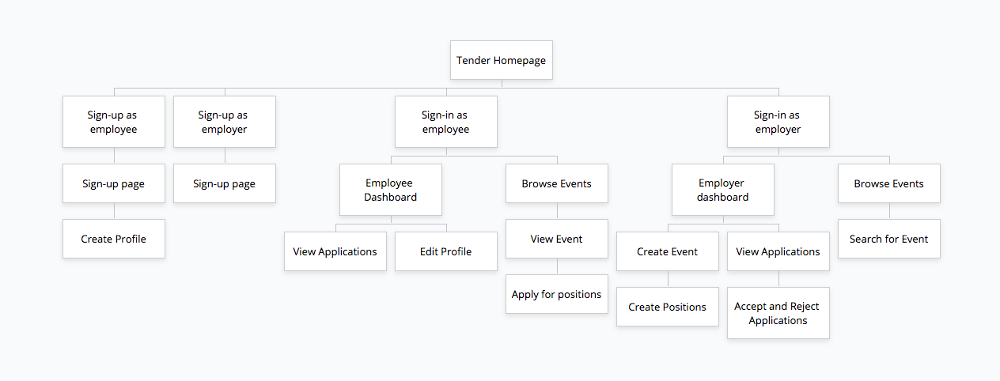

###### Screenshots 
Add after changing database

###### Target Audience
The target audience is organisers of any events such as sporting events, music festivals and food festivals. These event organisers will need temporary staff such as security staff, wait staff and bartenders. The target audience of workers are individuals that need casual work for extra money or those looking to attend events but would like to work. These individuals could be people working part-time, students or full-time workers looking to attend particular events without paying for the tickets reducing thier costs of attending. 

###### Tech Stack 
* Ruby on Rails 
* AWS S3 
* PostgreSQL
* Heroku
* HTML
* SCSS 

#### R12 User Stories
I have created the user stories for:
* The employer - the event organiser
* the employee - the individual searching for a job

I used the card board to demonstrate the user stories and the future features that could be added to improve the functionality of the web application. The user stories show the minimum abilities of the application to achieve the needs of the users. The MVP was achieved in the first iteration. 

As an employer, I want to: 
* Sign-up to create an account
* Add events so workers can see them 
* Add positions to the events for workers to apply so I can advertise the jobs
* See the applicants that have applied for my positions so I can pick a suitable applicant
* Accept and reject the applications so I can hire the workers I have chosen


As an employee, I want to: 
* Sign-up and create a profile so employers can visit my profile
* Browse and search for events so I can find the events I would like to work at
* Apply for the positions at certain events so I can get a job that is suitable
* See the status of my applications so I know if I have been selected

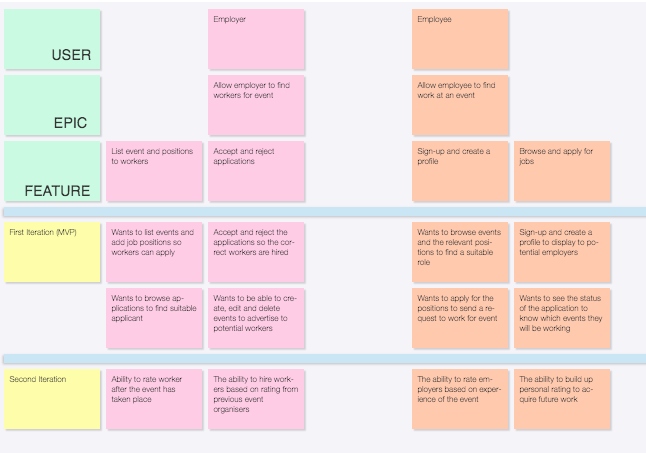

#### R13 Wireframes 

Below are my web application wireframes that I created using Figma:

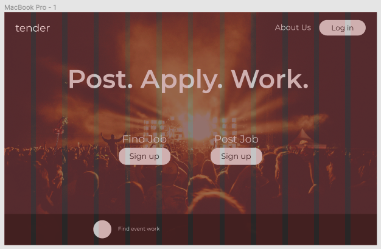

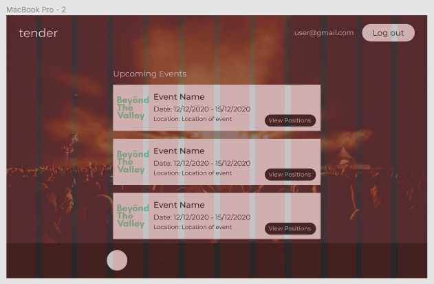

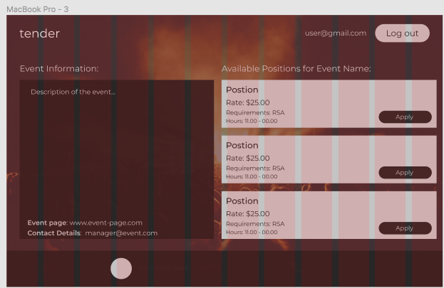

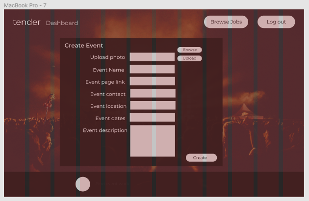

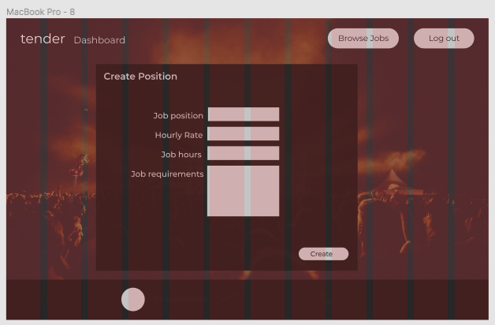

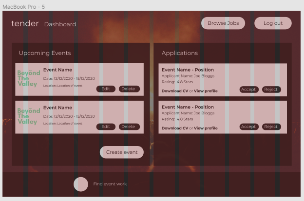

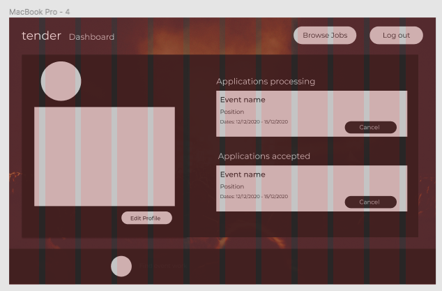

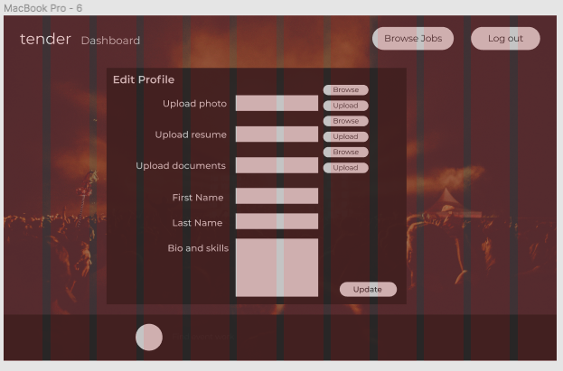


###### Mobile view wireframes:
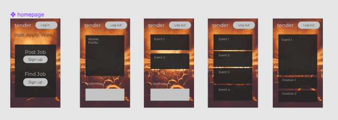


#### R14 ERD for Tender

Below is my entity relationship diagram (ERD) that was created using Lucid Chart:

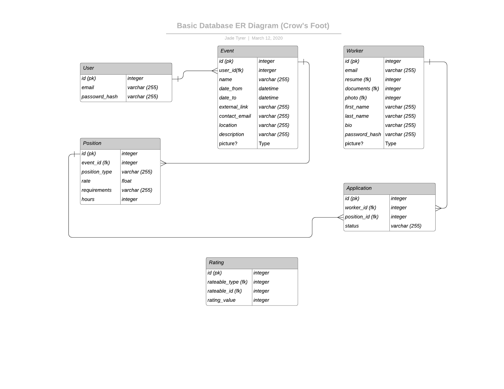

#### R15 High Level Abstractions 

My application is built using Ruby on Rails this is a framework written in the Ruby language. Ruby is a high-level programming language that is written in a lower level language called C. The C programming language will then convert the Ruby code into machine code and finally into binary for the hardware to understand. Each of these layers are known as layers of abstraction as they are abstracting away from the hardware into code that humans can understand. 

For example, in Ruby on Rails, ActiveRecord is layer of abstraction from SQL that makes the code more readable when talking to the database (in this case to PostgreSQL which is also written in C). 

Another high-level abstraction in the appliccation is the rails helper when creating forms. Writing a form in HTML can take a lot of code but the layer of abstraction that Rails provides makes it mush shorter and simpler to build, Action View Form Helper. 

RESTful Routes are another high-level abstraction that is provided in Rails. Routes allow the HTTP requests to be easily implemented. The ```routes.rb``` file will allow the correct HTTP request to be mapped to the controller and provide the next URL to be displayed. 


#### R16 Third party APIs

Devise is a Gem that will take care of the authentication of my web application such as the signing-up and logging-in. I will be using Devise to authenticate users of Tender and will create two different models. I will create a Devise user model that will be used to identify the employers and allow thm to havre a separate sign-up and log-in to the workers. Workers will have their own model this allows the different content to be available depending on the logged-in user. The Devise Gem takes care of all of the code relating to authentication such as the models, controllers and routes. 

I will be utilising AWS (Amazon Web Services) S3 (Simple Storage Service) to store my data related to the images and documentation that will be uploaded by the users of Tender. When the users upload information it will be sent to a bucket that I have connected with my Rails application via protected keys. 

#### R17 Project Models 
The Tender Active Record Models:
* Devise user model :has_one :user_profile and :has_many :applications
* User_profile :belongs_to :worker, has_one: :photo, has_one: :document and has_one: :resume
* Devise worker model :has_one :user_profile and has_many: :events
* Worker_profile (created as worker signs up) belongs_to: :worker 
* Event has_one_attached :picture, has_many_attached :positions and has_many_attached: :applications, through: :positions
* Position (created after a employer has created an event)belongs_to: :event and has_many: :applications
* Application (created once the worker has clicked apply on a position) belongs_ to: :position and belongs_to: :worker

These connections can also be seen in the database schema.

#### R18 Database Relations 
The relations in Tender will have both one-to-one and one-to-many relationships. Any many-to-many relationships will be dealt with by creating a new table to connect them. This can be seen in the case of applications where the worker could have apply for many positions and the positions could have many workers apply therefore the application table is created. 

#### R19 Database Schema 
Below is the Rails database schema for Tender:
``` ruby
  create_table "active_storage_attachments", force: :cascade do |t|
    t.string "name", null: false
    t.string "record_type", null: false
    t.bigint "record_id", null: false
    t.bigint "blob_id", null: false
    t.datetime "created_at", null: false
    t.index ["blob_id"], name: "index_active_storage_attachments_on_blob_id"
    t.index ["record_type", "record_id", "name", "blob_id"], name: "index_active_storage_attachments_uniqueness", unique: true
  end

  create_table "active_storage_blobs", force: :cascade do |t|
    t.string "key", null: false
    t.string "filename", null: false
    t.string "content_type"
    t.text "metadata"
    t.bigint "byte_size", null: false
    t.string "checksum", null: false
    t.datetime "created_at", null: false
    t.index ["key"], name: "index_active_storage_blobs_on_key", unique: true
  end

  create_table "applications", force: :cascade do |t|
    t.bigint "worker_id", null: false
    t.bigint "position_id", null: false
    t.string "status"
    t.datetime "created_at", precision: 6, null: false
    t.datetime "updated_at", precision: 6, null: false
    t.index ["position_id"], name: "index_applications_on_position_id"
    t.index ["worker_id"], name: "index_applications_on_worker_id"
  end

  create_table "events", force: :cascade do |t|
    t.string "name"
    t.string "location"
    t.string "external_link"
    t.string "contact_email"
    t.text "description"
    t.datetime "created_at", precision: 6, null: false
    t.datetime "updated_at", precision: 6, null: false
    t.date "date_from"
    t.date "date_to"
    t.bigint "user_id"
    t.index ["user_id"], name: "index_events_on_user_id"
  end

  create_table "positions", force: :cascade do |t|
    t.string "position_type"
    t.float "rate"
    t.text "requirements"
    t.string "hours"
    t.bigint "event_id", null: false
    t.datetime "created_at", precision: 6, null: false
    t.datetime "updated_at", precision: 6, null: false
    t.text "additional_information"
    t.index ["event_id"], name: "index_positions_on_event_id"
  end

  create_table "user_profiles", force: :cascade do |t|
    t.bigint "user_id", null: false
    t.datetime "created_at", precision: 6, null: false
    t.datetime "updated_at", precision: 6, null: false
    t.index ["user_id"], name: "index_user_profiles_on_user_id"
  end

  create_table "users", force: :cascade do |t|
    t.string "email", default: "", null: false
    t.string "encrypted_password", default: "", null: false
    t.string "reset_password_token"
    t.datetime "reset_password_sent_at"
    t.datetime "remember_created_at"
    t.datetime "created_at", precision: 6, null: false
    t.datetime "updated_at", precision: 6, null: false
    t.index ["email"], name: "index_users_on_email", unique: true
    t.index ["reset_password_token"], name: "index_users_on_reset_password_token", unique: true
  end

  create_table "worker_profiles", force: :cascade do |t|
    t.bigint "worker_id", null: false
    t.string "first_name"
    t.string "last_name"
    t.text "bio"
    t.datetime "created_at", precision: 6, null: false
    t.datetime "updated_at", precision: 6, null: false
    t.string "city"
    t.string "country"
    t.integer "number"
    t.index ["worker_id"], name: "index_worker_profiles_on_worker_id"
  end

  create_table "workers", force: :cascade do |t|
    t.string "email", default: "", null: false
    t.string "encrypted_password", default: "", null: false
    t.string "reset_password_token"
    t.datetime "reset_password_sent_at"
    t.datetime "remember_created_at"
    t.datetime "created_at", precision: 6, null: false
    t.datetime "updated_at", precision: 6, null: false
    t.index ["email"], name: "index_workers_on_email", unique: true
    t.index ["reset_password_token"], name: "index_workers_on_reset_password_token", unique: true
  end

  add_foreign_key "active_storage_attachments", "active_storage_blobs", column: "blob_id"
  add_foreign_key "applications", "positions"
  add_foreign_key "applications", "workers"
  add_foreign_key "events", "users"
  add_foreign_key "positions", "events"
  add_foreign_key "user_profiles", "users"
  add_foreign_key "worker_profiles", "workers"
end
```


#### R20 Project Tracking

I used Trello to track the progress of my web application. I broke the large project down into smaller tasks following the Agile approach to project management. I then moved each of my smaller task cards into a group called in progress or done. This way I knew which stage I was at with each of the tasks. I then added in any additional tasks I found along the way. This was an efficient way of making sure that I was on track with deadlines and the project would be completed on time. I have provided screenshots of the Trello board:

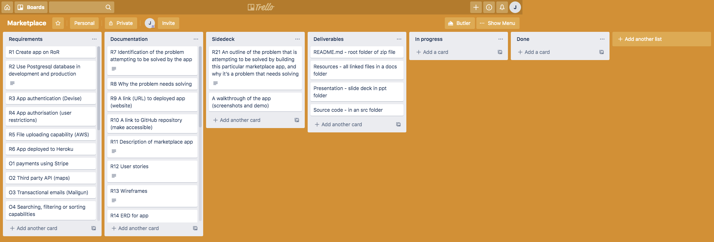

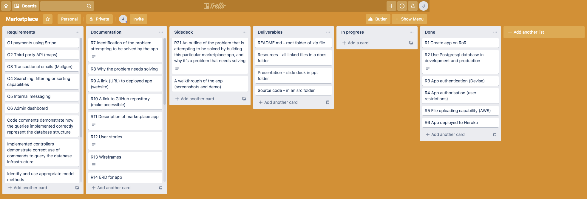

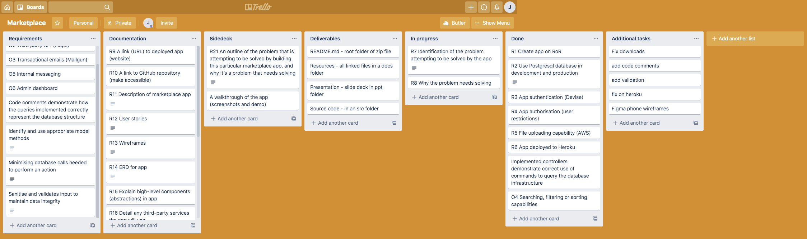

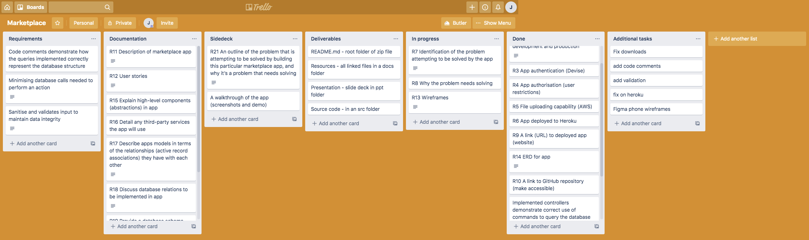

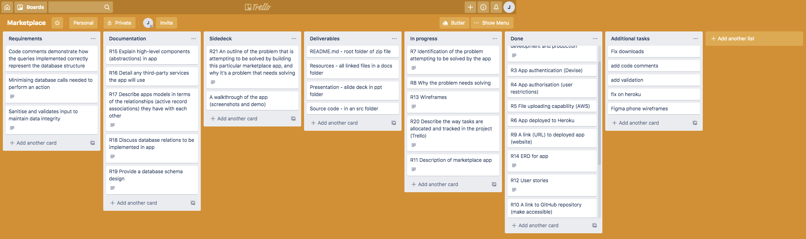

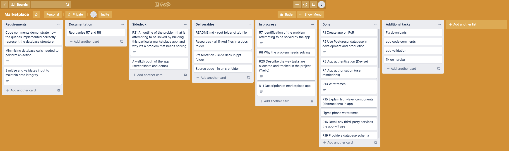


